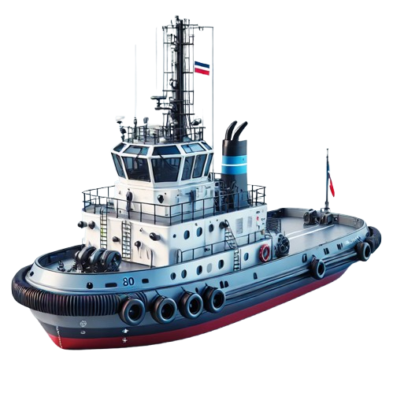
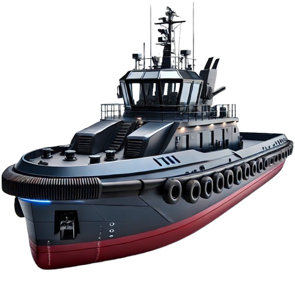
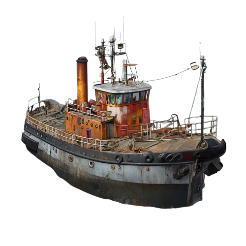
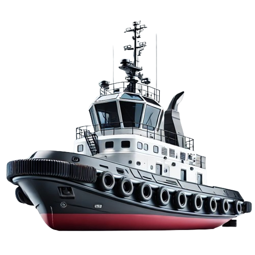
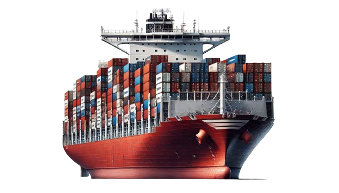
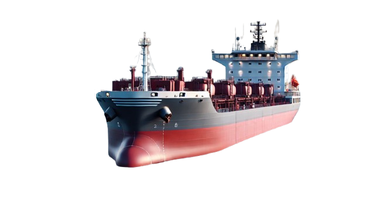
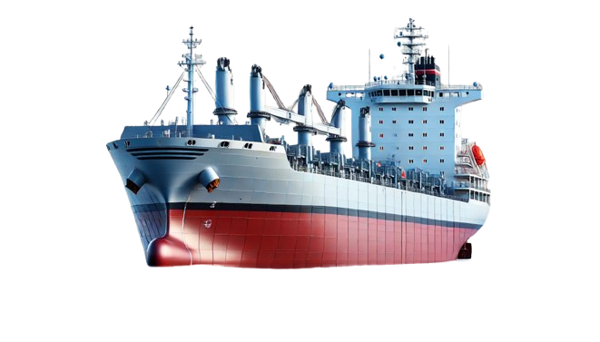
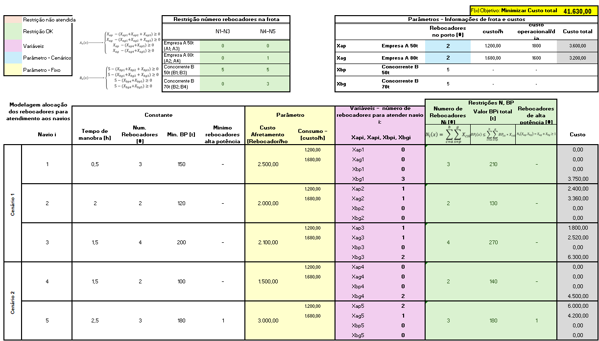
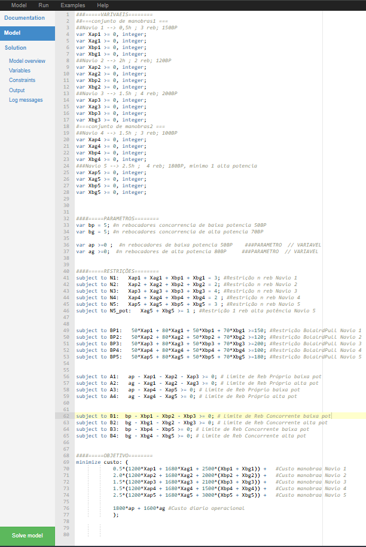
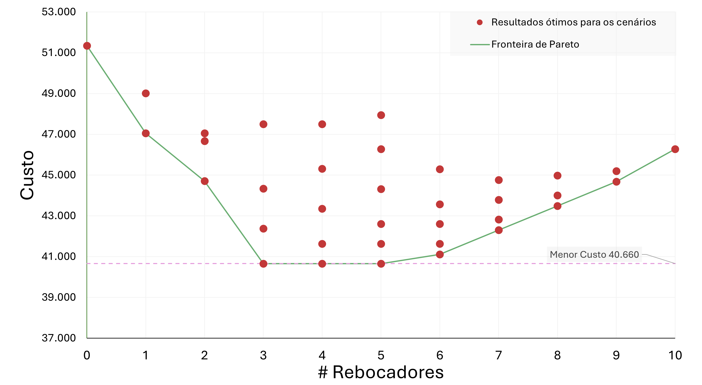

# Alocação de Rebocadores em portos

Empresas de reboque potuário realizam estudos e pesquisas visando entender como estruturar seus rebocadores em um novo porto ou em um porto que já atua

## Conceitos
Inicialmente, vamos entender como é  a operação de rebocadores portuários utilizando o vídeo abaixo.

### Requisitos de força e rebocadores para atender um navio

Para atender a manobra de um navio no porto, existem regulamentações que calculam o número mínimo de rebocadores necessários para atuar em uma operação, assim como o somatório de bollardpull necesário.

Hessen(2018) apresenta graficamente o número médio de rebocadores e BollardPull necessário para atender os navios, baseado nos valores de DeadWeight e comprimento total do navio.

Fonte: Hessen(2018)

Fonte: Hessen(2018)

Porém, no Brasil, as autoridades maritimas definem as regulamentações de rebocadores de acordo com as localidades, conforme imagem abaixo retirada da NPCP-SC, que indica os requerimento para o porto de Itajaí.

Fonte: Brasil(2022)

## Problema

### Enunciado

A empresa AlphaTugs deseja estruturar as operações de rebocadores no porto de Landville. Com sua frota, a empresa tem disponibilidade de alocar até 5 rebocadores de alta potência (80t BP) e 5 rebocadores de baixa potência (50t BP).

A equipe responsável por realizar o estudo de mercado, constatou que nas empresas concorrentes locais, possuem 5 rebocadores de baixa potência (50t BP), e 5 rebocadores de alta potência (70t BP). Também, notaram que é comum ocorrer manobras simultaneas dos navios clientes. Em um caso dia mais crítico, ocorre 1 conjuto de manobras de 3 navios ao mesmo tempo, e em outro momento um conjunto de manobras com 2 navios ao mesmo tempo.

Entre as empresas de rebocadores, quando não há rebocadores suficientes para o atendimento de um cliente, ocorre o afretamento. Afretamento é quando um empresa de reboque portuário contrata o concorrente para realizar sua manobra. Esta situação possui um custo especifico para cada tipo de navio, e cada empresa posui sua tabela de cálculo.

A AlphaTugs, deseja alocar seus rebocadores da melhor forma possível, com o objetivo de reduzir o custo total de operação diário.

Abaixo, estão os requisitos dos navios para atendimento, custos dos rebocadores e caracteristicas das frotas.

|**AlphaTugs**|||
|-------------|-------------|-------------|
||Baixa pot. [Xap]|Alta Pot. [Xag|
|Consumo de combustível/hora [$]|1200|1680|
|Custo operacional/dia|1800|1600|
|BollardPull [t]|50|80|

|**Concorrentes**|||
|-------------|-------------|-------------|
||Baixa pot. [Xbp]|Alta Pot. [Xbg]|
|BollardPull [t]|50|70|

Situação de manobras 1:

|-||||
|-------------|-------------|-------------|-------------|
|Navio i|1|2|3|
|Tempo de manobra [h]|0.5|2|1.5|
|Num. Rebocadores [#]|3|2|4|
|BP minimo [t]|150|120|200|
|Rebocador de alta potência [#]|--|--|--|
|Custo de afretamento/rebocador/hora [$]|2500|2000|2100|

Situação de manobras 2:

|-|||
|-------------|-------------|-------------|
|Navio i|4|5|
|Tempo de manobra [h]|1.5|2.5|
|Num. Rebocadores [#]|2|3|
|BP minimo [t]|100|180|
|Rebocador de alta potência [#]|--|1|
|Custo de afretamento/rebocador/hora [$]|1500|3000|

## Modelagem

### Nomenclatura

- $c \in \{a,b\}$ → a = AlphaTugs; b = Concorrente
- $s \in \{p,g\}$ → p = baixa potência; g = alta potência
- $i \in \{1,2,3,4,5\}$ → Identificação do navio

### Variáveis
||||||
|------|------|------|------|------|
|i=1|i=2|i=3|i=4|i=5|
|$$X_{ap1}$$|$$X_{ap2}$$|$$X_{ap3}$$|$$X_{ap4}$$|$$X_{ap5}$$|
|$$X_{ag1}$$|$$X_{ag2}$$|$$X_{ag3}$$|$$X_{ag4}$$|$$X_{ag5}$$|
|$$X_{bp1}$$|$$X_{bp2}$$|$$X_{bp3}$$|$$X_{bg4}$$|$$X_{bp5}$$|
|$$X_{bg1}$$|$$X_{bg2}$$|$$X_{bg3}$$|$$X_{bg4}$$|$$X_{bg5}$$|

### Restrições

**Número de rebocadores para atender o navio i**

$$
N_i(x) = \sum_{c=a}^{b} \sum_{s=p}^{g} X_{csi} \quad \rightarrow \quad
\begin{cases} 
X_{ap1} + X_{ag1} + X_{bp1} + X_{bg1} = 3, \\
X_{ap2} + X_{ag2} + X_{bp2} + X_{bg2} = 2, \\
X_{ap3} + X_{ag3} + X_{bp3} + X_{bg3} = 4, \\
X_{ap4} + X_{ag4} + X_{bp4} + X_{bg4} = 2, \\
X_{ap5} + X_{ag5} + X_{bp5} + X_{bg5} = 3.
\end{cases}
$$

**Bollard Pull mínimo para atender o navio i**

$$
BP_i(x) \leq \sum_{c=a}^{b} \sum_{s=p}^{g} BP_{cs} \cdot X_{csi} \quad \rightarrow \quad
\begin{cases}
50X_{ap1} + 80X_{ag1} + 50X_{bp1} + 70X_{bg1} \geq 150, \\
50X_{ap2} + 80X_{ag2} + 50X_{bp2} + 70X_{bg2} \geq 120, \\
50X_{ap3} + 80X_{ag3} + 50X_{bp3} + 70X_{bg3} \geq 200, \\
50X_{ap4} + 80X_{ag4} + 50X_{bp4} + 70X_{bg4} \geq 100, \\
50X_{ap5} + 80X_{ag5} + 50X_{bp5} + 70X_{bg5} \geq 180.
\end{cases}
$$

**Garantia de rebocadores na frota AlphaTugs (a)**

$$
A_n(x) \rightarrow 
\begin{cases}
X_{ap} - (X_{ap1} + X_{ap2} + X_{ap3}) \geq 0, \\
X_{ag} - (X_{ag1} + X_{ag2} + X_{ag3}) \geq 0, \\
X_{ap} - (X_{ap4} + X_{ap5}) \geq 0, \\
X_{ag} - (X_{ag4} + X_{ag5}) \geq 0.
\end{cases}
$$

**Garantia de rebocadores na frota concorrente (b)**

$$
B_n(x) \rightarrow 
\begin{cases}
5 - (X_{bp1} + X_{bp2} + X_{bp3}) \geq 0, \\
5 - (X_{bg1} + X_{bg2} + X_{bg3}) \geq 0, \\
5 - (X_{bp4} + X_{bp5}) \geq 0, \\
5 - (X_{bg4} + X_{bg5}) \geq 0.
\end{cases}
$$

**Objetivo: Minimizar o custo total diário de operação**

$$
F(x) = Min 
\begin{cases}
0.5 \cdot (1200 \cdot X_{ap1} + 1680 \cdot X_{ag1} + 2500 \cdot (X_{bp1} + X_{bg1})) + \\
1.5 \cdot (1200 \cdot X_{ap4} + 1680 \cdot X_{ag4} + 1500 \cdot (X_{bp4} + X_{bg4})) + \\
1.5 \cdot (1200 \cdot X_{ap3} + 1680 \cdot X_{ag3} + 2100 \cdot (X_{bp3} + X_{bg3})) + \\
2.0 \cdot (1200 \cdot X_{ap2} + 1680 \cdot X_{ag2} + 2000 \cdot (X_{bp2} + X_{bg2})) + \\
2.5 \cdot (1200 \cdot X_{ap5} + 1680 \cdot X_{ag5} + 3000 \cdot (X_{bp5} + X_{bg5})) + \\ 
1800 \cdot X_{ap} + 1600 \cdot X_{ag}.
\end{cases}
$$

### Resumo

| Atributos de entrada | Atributos de saída |
|---------------------|-------------------|
| Variáveis $X_{csi}$ | Restrições BP $BP_i(x) \leq \sum_{c=a}^{b} \sum_{s=p}^{g} BP_{cs} * X_{csi}$ |
| Parâmetros (Custos; Bollard Pull; Rebocadores alocados $X_{ap}$ e $X_{ag}$) | Restrições rebocadores na manobra $N_i(x) = \sum_{c=a}^{b} \sum_{s=p}^{g} X_{csi}$ |
| Constantes (Tempo de manobra) | Restrições limite frota (a) $A_n(x)$ |
| | Restrições limite frota (b) $B_n(x)$ |
| | Objetivo Minimizar custo $F(x) = Min(custo)$ |

## Ferramentas

Para realizar a otimização foram utilzadas as ferramentas MS Excel (solver) e o site (https://online-optimizer.appspot.com/?model=builtin:default.mod)

Identificou-se que o problema é um caso de **Programação linear - Programação Inteira**

## Análises

Para resolver este problema, podemos criar cenários variando a quantidade de rebocadores de acordo com sua potência, de forma a avaliar todas as combinações.

Considerando a possibilidade de varia de 0 a 5 cada tipo de rebocador da empresa, temos um total de 36 possibilidades "ótimas" a avaliar.

|$$X_{ap}$$|$$X_{ag}$$|Total Rebocadoree|
|-----|-----|-----|
|0|0|0|
|0|1|1|
|0|2|2|
|...|...|...|
|5|5|10|

Ao realizar o processo de otimização para as combinações, temos o seguinte resultado

|Xap|Xag|# Rebocadores|Resultados ótimos para os cenários|
|-----|-----|-----|-----|
|0|0|0|51350|
|1|0|1|47050|
|2|0|2|47050|
|3|0|3|47500|
|4|0|4|47500|
|5|0|5|47950|
|0|1|1|49010|
|1|1|2|44710|
|2|1|3|40660|
|3|1|4|40660|
|4|1|5|40660|
|5|1|6|41110|
|0|2|2|46670|
|1|2|3|42380|
|2|2|4|41630|
|3|2|5|41630|
|4|2|6|41630|
|5|2|7|42300|
|0|3|3|44340|
|1|3|4|43350|
|2|3|5|42600|
|3|3|6|42600|
|4|3|7|42820|
|5|3|8|43490|
|0|4|4|45310|
|1|4|5|44320|
|2|4|6|43570|
|3|4|7|43790|
|4|4|8|44010|
|5|4|9|44680|
|0|5|5|46280|
|1|5|6|45290|
|2|5|7|44760|
|3|5|8|44980|
|4|5|9|45200|
|5|5|10|46280|

Podemos verificar a fronteira de Pareto, para determinar o menor número de rebocarodes e o menor custo possível de operação.

Com isso, chega-se ao melhor resultado avaliado de **2 rebocadores de baixa potência e 1 rebocador de alta potência** para alocar neste porto para ter o menor custo de operação, com o resultado de **$40.660,00**

## Referências

3D-LIVING-STUDIO. How a Tugboat Tows Ships 1000 Times Bigger - Z-Drive Tugboat.2024. Disponível em: <https://www.youtube.com/watch?v=9vzHKRu-wAk>.

BRASIL, M. do. NPCP-CPSC. 2022. Disponível em: <https://www.marinha.mil.br/cpsc/npcp>.

HENSEN, H. Tug Use in Port: A Practical Guide Including Ports, Port Approaches and Offshore Terminals. [S.l.]: ABR Company, 2018. Google-Books-ID: xZN0tgEACAAJ.ISBN 978-1-904050-34-6.

