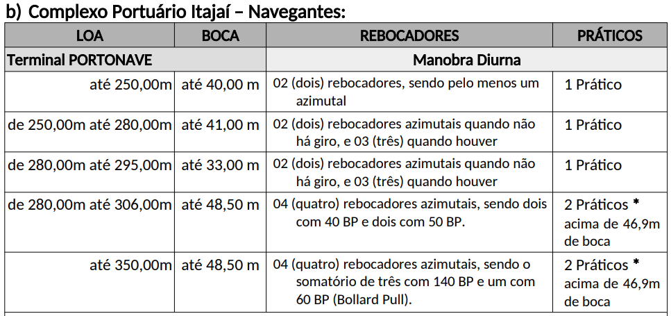

# Alocação de Rebocadores em portos

Empresas de reboque potuário realizam estudos e pesquisas visando entender como estruturar seus rebocadores em um novo porto ou em um porto que já atua

## Conceitos
Inicialmente, vamos entender como é  a operação de rebocadores portuários utilizando o vídeo abaixo.

### Requisitos de força e rebocadores para atender um navio

Para atender a manobra de um navio no porto, existem regulamentações que calculam o número mínimo de rebocadores necessários para atuar em uma operação, assim como o somatório de bollardpull necesário.

Hessen (2013) apresenta graficamente o número médio de rebocadores e BollardPull necessário para atender os navios, baseado nos valores de DeadWeight e comprimento total do navio.

Porém, no Brasil, as autoridades maritimas definem as regulamentações de rebocadores de acordo com as localidades, conforme imagem abaixo retirada da NPCP-SC, que indica os requerimento para o porto de Itajaí.

## Problema

### Enunciado

A empresa AlphaTugs deseja estruturar as operações de rebocadores no porto de Landville. Com sua frota, a empresa tem disponibilidade de alocar até 5 rebocadores de alta potência (80t BP) e 5 rebocadores de baixa potência (50t BP).

A equipe responsável por realizar o estudo de mercado, constatou que nas empresas concorrentes locais, possuem 5 rebocadores de baixa potência (50t BP), e 5 rebocadores de alta potência (70t BP). Também, notaram que é comum ocorrer manobras simultaneas dos navios clientes. Em um caso dia mais crítico, ocorre 1 conjuto de manobras de 3 navios ao mesmo tempo, e outro conjunto de manobras com 2 navios ao mesmo tempo.

A AlphaTugs, deseja alocar seus rebocadores da melhor forma possível, com o objetivo de reduzir o custo total de operação diário.

Abaixo, estão os requisitos dos navios para atendiment, custos dos rebocadores e caracteristicas das frotas.

|**AlphaTugs**|||
|-------------|-------------|-------------|
||Baixa pot. [Xap]|Alta Pot. [Xag|
|Consumo de combustível/hora [$]|1200|1680|
|Custo operacional/dia|1800|1600|
|BollardPull [t]|50|80|

|**Concorrentes**|||
|-------------|-------------|-------------|
||Baixa pot. [Xbp]|Alta Pot. [Xbg|
|BollardPull [t]|50|70|

## Modelagem

$$
N_i(x) = \sum_{c=a}^{b} \sum_{s=p}^{g} X_{csi} \quad \rightarrow \quad
\begin{cases} 
X_{ap1} + X_{ag1} + X_{bp1} + X_{bg1} = 3, \\
X_{ap2} + X_{ag2} + X_{bp2} + X_{bg2} = 2, \\
X_{ap3} + X_{ag3} + X_{bp3} + X_{bg3} = 4, \\
X_{ap4} + X_{ag4} + X_{bp4} + X_{bg4} = 2, \\
X_{ap5} + X_{ag5} + X_{bp5} + X_{bg5} = 3.
\end{cases}
$$

$$
BP_i(x) \leq \sum_{c=a}^{b} \sum_{s=p}^{g} BP_{cs} \cdot X_{csi} \quad \rightarrow \quad
\begin{cases}
50X_{ap1} + 80X_{ag1} + 50X_{bp1} + 70X_{bg1} \geq 150, \\
50X_{ap2} + 80X_{ag2} + 50X_{bp2} + 70X_{bg2} \geq 120, \\
50X_{ap3} + 80X_{ag3} + 50X_{bp3} + 70X_{bg3} \geq 200, \\
50X_{ap4} + 80X_{ag4} + 50X_{bp4} + 70X_{bg4} \geq 100, \\
50X_{ap5} + 80X_{ag5} + 50X_{bp5} + 70X_{bg5} \geq 180.
\end{cases}
$$

$$
A_n(x) \rightarrow 
\begin{cases}
X_{ap} - (X_{ap1} + X_{ap2} + X_{ap3}) \geq 0, \\
X_{ag} - (X_{ag1} + X_{ag2} + X_{ag3}) \geq 0, \\
X_{ap} - (X_{ap4} + X_{ap5}) \geq 0, \\
X_{ag} - (X_{ag4} + X_{ag5}) \geq 0.
\end{cases}
$$

$$
B_n(x) \rightarrow 
\begin{cases}
5 - (X_{bp1} + X_{bp2} + X_{bp3}) \geq 0, \\
5 - (X_{bg1} + X_{bg2} + X_{bg3}) \geq 0, \\
5 - (X_{bp4} + X_{bp5}) \geq 0, \\
5 - (X_{bg4} + X_{bg5}) \geq 0.
\end{cases}
$$

$$
F(x) = Min 
\begin{cases}
0.5 \cdot (1200 \cdot X_{ap1} + 1680 \cdot X_{ag1} + 2500 \cdot (X_{bp1} + X_{bg1})) + \\
1.5 \cdot (1200 \cdot X_{ap4} + 1680 \cdot X_{ag4} + 1500 \cdot (X_{bp4} + X_{bg4})) + \\
1.5 \cdot (1200 \cdot X_{ap3} + 1680 \cdot X_{ag3} + 2100 \cdot (X_{bp3} + X_{bg3})) + \\
2.0 \cdot (1200 \cdot X_{ap2} + 1680 \cdot X_{ag2} + 2000 \cdot (X_{bp2} + X_{bg2})) + \\
2.5 \cdot (1200 \cdot X_{ap5} + 1680 \cdot X_{ag5} + 3000 \cdot (X_{bp5} + X_{bg5})) + \\ 
1800 \cdot X_{ap} + 1600 \cdot X_{ag}.
\end{cases}
$$

| Atributos de entrada | Atributos de saída |
|---------------------|-------------------|
| Variáveis $X_{csi}$ | Restrições BP $BP_i(x) \leq \sum_{c=a}^{b} \sum_{s=p}^{g} BP_{cs} * X_{csi}$ |
| Parâmetros (Custos; Bollard Pull; Rebocadores alocados $X_{ap}$ e $X_{ag}$) | Restrições rebocadores na manobra $N_i(x) = \sum_{c=a}^{b} \sum_{s=p}^{g} X_{csi}$ |
| Constantes (Tempo de manobra) | Restrições limite frota (a) $A_n(x)$ |
| | Restrições limite frota (b) $B_n(x)$ |
| | Objetivo Minimizar custo $F(x) = Min(custo)$ |

## Ferramentas

## Análises

